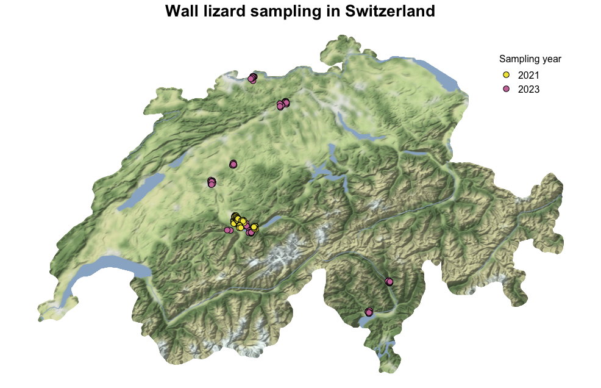

# Plotting maps in R 
## Wall lizard sampling in Switzerland
Author: Anna Orteu, afarreo@gmail.com

This is the GitHub repo hosting the tutorial on how to make maps in R found in: <https://rapidspeciation.github.io/making_maps_in_R/>

The turorial runs through how to plot maps and add data onto them such as sampling sites and borders, and how to crop maps using the outline of a country.

The example uses data from a project on wall lizards in Switzerland, in which we carried out two fieldwork trips (2021 and 2023).

The R script can be found in [scripts/map_wall_lizard_samples.R](scripts/map_wall_lizard_samples.R). And the sampling data in [data/Sample_gps.csv](data/Sample_gps.csv).

The figure below is an example of the maps shown in the tutorial. This is a map of Switzerland in which I have plotted the sampling sites for the two wall lizard fieldwork trips.

